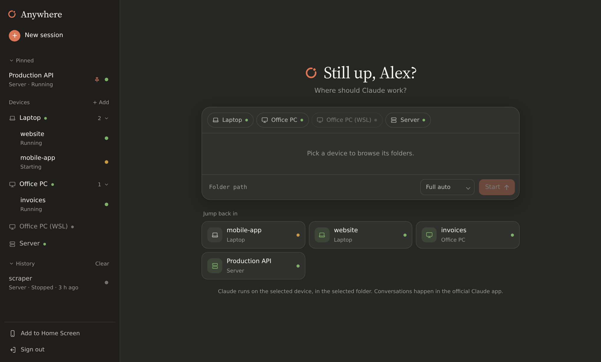
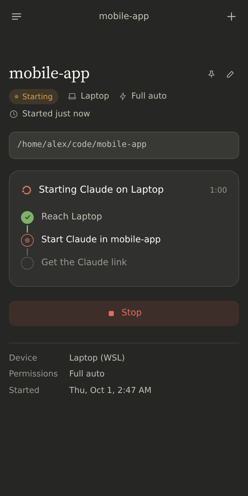
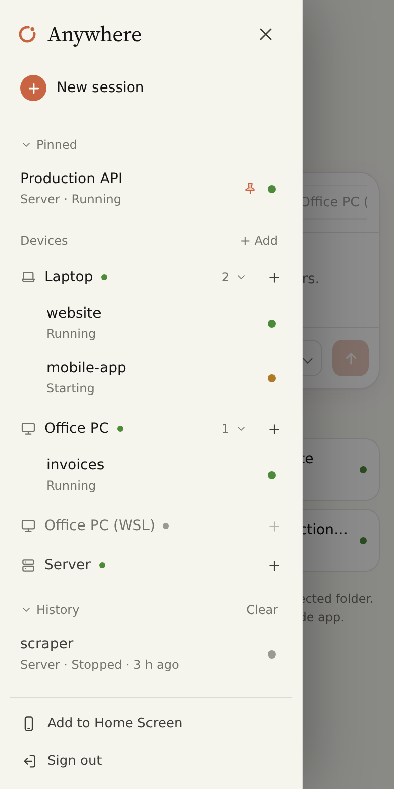

<div align="center">


# Anywhere

**Start Claude Code anywhere on any of your machines — from your phone.**

Pick a computer, pick a folder, tap Start. Anywhere opens a Claude Code session there and gives you the link to continue in the Claude app.

[Install](#install) · [How it works](#how-it-works) · [Security](#security) · [FAQ](#faq)

</div>

<br>



<table>
  <tr>
    <td width="50%"></td>
    <td width="50%"></td>
  </tr>
</table>

> [!NOTE]
> Anywhere is an independent open-source project. It is **not** affiliated with or endorsed by Anthropic. "Claude" and "Claude Code" are trademarks of Anthropic.

## Why

Claude Code's [Remote Control](https://docs.claude.com/en/docs/claude-code) lets you drive a session from the Claude app — but someone still has to start it on the machine. Anywhere is that someone:

- 🖥️ **All your machines in one list** — Linux servers, WSL and Windows PCs.
- 📂 **Browse folders** and start Claude where your project is.
- ⏱️ **Watch it start live**, answer Claude's first questions (folder trust…) from your phone.
- ⏹️ **Stop, restart, rename, pin** your sessions.
- 🔐 **Choose permissions** per session: *Ask*, *Accept edits* or *Full auto*.
- 📱 **Installable app** for your phone's Home Screen, light and dark mode.

## Install

You need a Linux server (any small VPS or home server) and [Claude Code](https://docs.claude.com/en/docs/claude-code) installed and signed in on each machine you want to use.

### 1 · Install the hub on your server

```sh
curl -fsSL https://github.com/raph559/anywhere/releases/latest/download/install.sh | sudo sh
```

It installs everything (Node.js included if needed) and asks how you'll open the app:

| Option | You get | Good for |
|---|---|---|
| **Tailscale** — picked automatically if installed | `https://server.your-tailnet.ts.net:8443`, private to your devices | the easiest private setup |
| **A domain name** | `https://anywhere.example.com`, HTTPS set up for you (Caddy) | reaching it from anywhere |
| **Your own reverse proxy** | whatever address you use (nginx, Traefik, Cloudflare Tunnel…) | servers that already host websites |
| **Local network only** | `http://192.168.1.20:18250` | trying it out at home |

Then it prints the address and your access key:

```
✓ Anywhere is running.

  Open:        https://anywhere.example.com
  Access key:  3kP9…          (shown once; keep it in your password manager)
```

<details>
<summary>Non-interactive install</summary>

```sh
curl -fsSL …/install.sh | sudo ANYWHERE_DOMAIN=anywhere.example.com sh   # domain + automatic HTTPS
curl -fsSL …/install.sh | sudo ANYWHERE_ORIGIN=https://my-address sh     # your own proxy → 127.0.0.1:18250
curl -fsSL …/install.sh | sudo ANYWHERE_LAN=1 sh                          # local network, plain http
```
</details>

### 2 · Add your machines from the app

Open the address, sign in with the access key, then click **+ Add** next to *Devices*. Give the machine a name, pick its system, and paste the command it shows on that machine:

| System | Where to paste it |
|---|---|
| Linux / WSL | a terminal |
| Windows | PowerShell |

The machine appears online a few seconds later, and its agent starts automatically from then on.

### 3 · On your phone

Open the same address on your phone, sign in, then **Share → Add to Home Screen** (needs an HTTPS address).

**That's it.** To update later, run the install command again: your settings, devices and sessions are kept, and every machine updates its agent by itself.

## How it works

```
   your phone ────── HTTPS ──────▶  hub  (your server)
                                     ▲
                   outbound only     │   one secret per machine
          ┌──────────────────────────┼──────────────────────────┐
     agent · laptop           agent · office PC            agent · server
          │                          │                          │
  claude remote-control      claude remote-control      claude remote-control
```

- The **hub** is a single Node.js file that serves the app and passes commands along. It never sees your Claude login.
- Each **agent** is a single Python file. It connects *out* to the hub (no ports to open on your computers), browses folders inside your home folder, and starts or stops `claude remote-control`.
- Your conversations happen in the official Claude app; Anywhere only manages the sessions.

## Security

Anywhere can start Claude Code with full permissions on your machines from a web page. Please read this:

- **Prefer a private address.** With Tailscale or a local network, only your own devices can even reach the sign-in page. With a public domain, the sign-in is protected by a long random access key and rate limiting, but it is still reachable by anyone — use a strong setup (HTTPS only, keep the key secret).
- **Plain http is for local networks only**: traffic, including device secrets, is not encrypted.
- **Secrets are hashed.** The access key and each machine's secret are stored as SHA-256 hashes. Device codes work once and expire after 30 minutes.
- **Agents stay in their lane.** They only browse your home folder and only stop the Claude processes they started.
- **Full auto is powerful.** Claude will edit and run anything on that machine without asking. Use *Ask* or *Accept edits* when in doubt.
- **Updates are signed.** Agents only install new versions signed with your server's own key (kept root-only, out of the web service's reach). Set `"autoUpdate": false` in an agent's `config.json` to opt out.

## FAQ

<details>
<summary><b>Does it work on macOS?</b></summary>

Not yet: the agent relies on Linux and Windows process APIs. The app itself works in any browser.
</details>

<details>
<summary><b>I lost my access key.</b></summary>

On the server: `sudo sh /opt/anywhere/deploy/reset-access-key.sh` prints a new one.
</details>

<details>
<summary><b>A machine stays offline.</b></summary>

- Linux server: `systemctl status anywhere-agent`
- WSL / desktop Linux: `systemctl --user status anywhere-agent`, or `~/.anywhere-agent/agent.log`
- Windows: Task Scheduler → *Anywhere agent*

The machine must be awake and connected to the internet.
</details>

<details>
<summary><b>"Taking longer" while starting.</b></summary>

Claude Code on that machine is probably waiting for a sign-in or a setup prompt. Open Claude Code there once, then try again.
</details>

<details>
<summary><b>Do I need Tailscale?</b></summary>

No. It's one option: the installer also supports a domain name with automatic HTTPS, your own reverse proxy, or your local network. See [Install](#install).
</details>

<details>
<summary><b>Manual setup / configuration reference</b></summary>

- Hub configuration: `/etc/anywhere/config.json` — see [examples/hub-config.json](examples/hub-config.json). Devices listed there are managed by hand; devices added from the app are stored in `/var/lib/anywhere/state.json`.
- Agent configuration: `config.json` next to `device_agent.py` — see [examples/agent-config.json](examples/agent-config.json).
- New secret and its hash: [deploy/new-secret.sh](deploy/new-secret.sh). Linux agent as a system service: [deploy/install-agent-linux.sh](deploy/install-agent-linux.sh).
- Publishing an agent update by hand: raise `VERSION` in `public/install/device_agent.py`, then `sudo python3 /opt/anywhere/deploy/publish-agent.py`.
</details>

## License

[MIT](LICENSE). The bundled Source Serif 4 font is under the [SIL Open Font License](public/fonts/OFL.txt).
